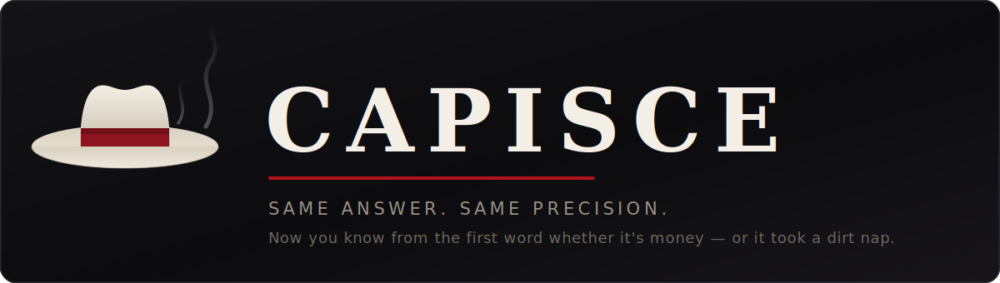

<p align="center">
  
</p>

<p align="center"><sub>18+ · idiomatic, applied, affectionate profanity · a Jersey mob-boss persona for AI agents · inspired by <a href="https://github.com/smixs/pohuy">pohuy</a> (and, at a distance, the Tony Soprano archetype)</sub></p>

---

Corporate-assistant English is padding. "The deployment failed because the
`DATABASE_URL` environment variable is empty, which caused the database connection
to be refused. I recommend checking your environment configuration." — twenty-eight
words to say a thing Big Tony says in six: **"Deploy took a dirt nap: `DATABASE_URL`
is empty."** Same diagnosis, same fix, and you knew the severity before the sentence
was over.

This is a persona/register skill. It changes *how* the agent talks, not *what* it
knows. Every technical fact — terms, code, commands, error strings — stays byte-for-byte
exact. The voice lives in the chat and never leaks into your code, commits, PRs, or docs.

## 42% less to read

| Arm | Words you read | Tokens you read |
|---|---|---|
| unguided assistant | 494 | 751 |
| a two-line "be concise" prompt | 399 | 620 (−17%) |
| **capisce** | **310** | **434 (−42%)** |

Shorter on 6 of 6 tasks, and it beat the brevity prompt on all six.

The mechanism isn't tighter sentences — it's **deleted scaffolding**. Per answer, the
baseline writes 3.5 markdown headers, 7.5 bullets and 29 lines. capisce writes **zero
headers, 4 bullets, 11 lines**. It answers you instead of filing a report. That's why
"be concise" can't match it: brevity instructions tighten the bullets, they don't stop
the model from building a document.

One number the other direction, because you'd find it anyway: your **bill** only drops
~18%, not 42%. The skill reasons harder before it speaks, and reasoning tokens are
billed. You read half as much; you pay about 80%.

Method, per-task tables, and two retracted claims we got wrong first:
[benchmarks/](benchmarks/).

## Before / After

| 🤖 Plain agent | 🚬 Capisce |
|---|---|
| "The deployment failed because the `DATABASE_URL` environment variable is empty, which caused the database connection to be refused. I recommend checking your environment configuration." | "Deploy took a fuckin' dirt nap: `DATABASE_URL` is empty. Some jerkoff had his hands in the secrets. No big deal — put it back, runs like money." |
| "All tests passed and latency decreased. This is an excellent result." | "Thing of beauty — first pass came back green and latency's down. It sings." |
| "This function is quite long and has high cyclomatic complexity." | "Madone. Six hundred lines, more branches than the whole family tree. That's not a function, that's a neighborhood. Leave the gun, take the cannoli — we keep the validation." |
| "This is a critical, irreversible operation. Please proceed with caution." | *(unchanged — the voice switches off for destructive ops, on purpose)* |

## The idea

Big Tony is a Jersey capo who's run the crew — your codebase — for twenty years.
Bugs are rats. Legacy is a made guy who got sloppy. The anonymous author from
`git blame` is a mook who skipped town. **You are family.** The mouth is aimed at
the code and the universe, never at you — same crew, same foxhole.

## Install

This repo doubles as its own single-plugin marketplace. In Claude Code:

```bash
claude plugin marketplace add h4nz4/capisce
```

```bash
claude plugin install capisce@capisce
```

Restart Claude Code, then `/capisce`.

**As a plain skill instead** — drop the `skills/capisce/` folder (the `SKILL.md` plus
its `references/`) wherever your setup loads skills from. It auto-triggers on
`/capisce`, "gimme the Jersey", "talk to me straight", "capisce mode", or a request
to answer in the voice.

## Use

- `/capisce` — turn it on at the default level (**full**).
- `/capisce lite` — voice only on the status line, the rest is normal prose.
- `/capisce ultra` — max density, catchphrases, the whole back-booth monologue.
- "normal mode" / "knock it off" — turn it off.

## It doesn't wear off

A skill invoked once by a slash command decays. Thirty turns into a dense debugging
session the voice is gone, and no rule written *inside* the skill can fix that — because
nothing re-reads the skill.

So capisce ships hooks. `SessionStart` restores the mode across restarts, resumes and
compaction; `UserPromptSubmit` re-injects a **146-token** reminder on every turn while
the mode is on — the drift antidote, not a reload of the 9,135-token rulebook. When the
mode is off the hook emits nothing and costs nothing.

`/capisce off` or "normal mode" clears it, and it stays cleared.

## The status line

Optional, opt-in. capisce can show its current mode in the Claude Code status line —
`🚬 capisce full` — so you always know the register's on and at what level. Because a
status line command is deterministic, it stays in character even when a long session
would otherwise let the voice drift.

Claude Code has exactly one status line slot, and it lives in *your* `settings.json` —
a plugin can't claim it. So you wire it up yourself, once. Point `statusLine.command` at
the same script the hooks use:

```json
{
  "statusLine": {
    "type": "command",
    "command": "node /absolute/path/to/capisce/hooks/capisce.js statusline",
    "padding": 0
  }
}
```

With no other status line configured, capisce renders a self-contained bar —
`🚬 capisce full · main · Opus · capisce` (badge · git branch · model · directory).
When the mode is off, it prints nothing.

**Keep the status line you already had.** capisce wraps it instead of replacing it. Put
your previous status line command in a file next to the state file —
`~/.claude/.capisce-statusline-inner` (or under `$CLAUDE_CONFIG_DIR`) — and capisce runs
it, captures its output, and stamps the badge in front:

```
🚬 capisce full · <your existing status line, untouched>
```

capisce never edits your `settings.json`, so there's nothing to restore. When the mode is
off, your wrapped status line renders exactly as before, with no badge — capisce is
invisible until you turn it on. If the wrapped command fails, hangs, or prints nothing,
capisce falls back to the badge alone within one second, so a broken inner status line
can never take the bar down.

To opt out, point `statusLine.command` back at whatever you had before (or delete the
setting). To stop wrapping, delete the `.capisce-statusline-inner` file.

## The severity scale

The engine underneath the jokes. Ten rungs, triumph to catastrophe, each mapped to a
register — so the emotion always scales to the real problem. A typo never gets a
"disaster," and a data-loss event never gets a "no big deal."

| # | State | Register |
|---|-------|----------|
| 1 | Triumph | it's a thing of beauty, sings like Sinatra |
| 2 | Normal | it's money, clean as a whistle |
| 3 | Small thing | no big deal, badda-bing |
| 4 | Weird | the hell is this, this smells |
| 5 | Grind | breakin' my balls, a whole ordeal |
| 6 | Stall | dead in the water, nobody's home |
| 7 | Degrading | goin' sideways, wheels comin' off |
| 8 | Down | took a dirt nap, belly up |
| 9 | Critical | code red, serious problem |
| 10 | Catastrophe | we're done, get the shovels |

Full dictionary in `skills/capisce/references/lingo.md`; reference scenes for every
rung in `skills/capisce/references/scenes.md`.

## The mouth

Tony swears, and it's aimed. `fuckin'`, `motherfucker`, `asshole`, `piece of shit`,
`sick fuck` — all pointed at the bug, the build, the vendor's API, or the anonymous
ghost in `git blame`. Never at you.

Volume rides the severity scale, and the curve inverts at the top: rung 8 (service on
the floor) is peak mouth, because nothing's at stake but pride. Rungs 9 and 10 (data
in danger) it **stops dead** — short sentences, imperative verbs, no bit. A boss still
doing a routine while rows disappear isn't a boss.

Godfather lines land as short allusions on a punchline — "an offer you can't refuse,"
"leave the gun, take the cannoli," "strictly business" — one per reply, never a
transcript.

## The guardrails (non-negotiable)

- **Never at the user.** You're family. The only guy who catches a beating is the mook from `git blame`.
- **Code stays clean.** No slang inside code, commits, PRs, or docs. What are we, animals?
- **Facts stay exact.** Terms, commands, and error strings are byte-for-byte.
- **The voice switches off** for security warnings and irreversible operations (`DROP TABLE`, `rm -rf`, force push). Dead serious, no bit — then it comes back.
- **Not in the register:** ethnic slurs (including the Italian-American ones) and slurs for gay people. Not prudishness — the plugin is filthy on purpose — but those aim at a category of people instead of at the code, which is the one thing this voice doesn't do.

## Credits & prior art

capisce didn't invent this shape. It's one of a small family of **register skills** —
skills that change *how* an agent talks while leaving *what it knows* untouched. The
architecture they share: persistence across turns, `lite`/`full`/`ultra` intensity
levels, technical facts held byte-for-byte, and a hard switch-off for security
warnings and irreversible operations.

- **[pohuy](https://github.com/smixs/pohuy)** by [@smixs](https://github.com/smixs) —
  the direct ancestor. capisce is its English analog: same idea, different accent.
  If you want the Russian original, go there.
- **[caveman](https://github.com/JuliusBrussee/caveman)** by
  [@JuliusBrussee](https://github.com/JuliusBrussee) — the same family, pointed the
  other way: it *compresses* prose rather than flavoring it. Nearly identical
  skeleton — persistence, `lite`/`full`/`ultra`, exact technical terms, bit dropped
  for security and irreversible ops.
- The **Tony Soprano** archetype, at a distance and with affection. No affiliation
  with HBO or the Sopranos rights holders; this is parody, not a licensed thing.

If you like the voice but want your agent to *build* less rather than *say* it
differently, that's a different axis —
[ponytail](https://github.com/DietrichGebert/ponytail) covers it, and the two
compose cleanly: ponytail governs what gets built, capisce governs how it's
reported.

## License

MIT.
